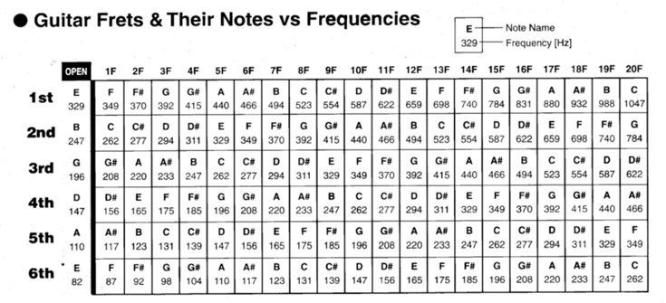
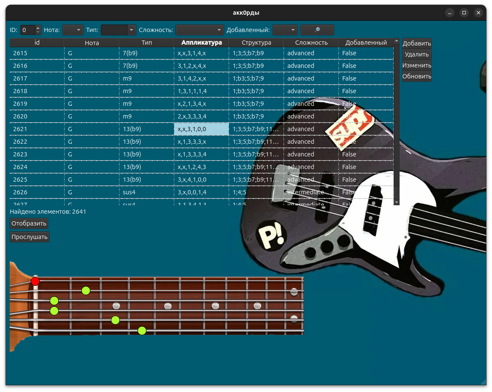
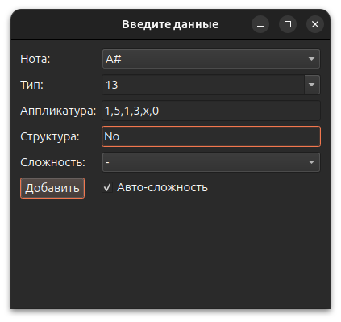

## 0) INFO:
[Как просто число преобразовать в звук гитарной струны](https://habr.com/ru/articles/514844/)

## 1) Основная идея: Десктопная программа на Python с графическим интерфейсом.
Программа предназначена работы с аппликатурами аккордов.
Программа хранит различные аккорды (название, тип, структура, положение пальцев).
Пользователь имеет возможности:
   1. Отобразижения всех имеющихся аккорды из бд
   2. Добавления собственных аккордов
   3. Поиска аккордов по названию, типу и т.п.
   4. Фильтрации аккордов по сложности (например, для начинающих, средних или продвинутых музыкантов)
   5. Послушать звучание каждого аккорда
## 2) Стек разработки:
   1. GUI - ==pyQt6==
   2. Data Base - ==sqlite3==
   3. ORM for Data Base - ==SQLAlchemy==
   4. Библиотеки для работы со звуком - scipy, sounddevice, soundfile
   5. Numpy 
## 3) Архитектура проекта:
##### Файлы:

- main.py: Главный файл, запускающий приложение.
- app.py: Основной файл с реализацией графического интерфейса.
- input.py: Графическая реализация диалогового окна
- models.py: Модуль с классом для хранения информации об аккордах.
- database.py: Модуль для взаимодействия с базой данных (SQLite).
- hz_to_guitar_sound.py: Класс, который образует из числа - звук гитарной струны.
- static_methods.py: Отдельные статические методы для работы программы.
- unput_dialog.py: Класс интерфейса диалогового окна.
- main_design.py: Класс основного интерфейса.

##### Классы и их фунции:
1. models.py:

	- Chord: Класс, представляющий аккорд.
	- chord_root: Корень аккорда (например, "A#").
	- style: Тип аккорда (например, "13").
    - finger_position: Строка с аппликатурой аккорда (например, "x,1,0,2,3,4").
	- structure: Строка с интервалами аккорда (например, "1;3;5;b7;9;11;13").
	- difficulty: Уровень сложности аккорда (например, "beginner", "intermediate", "advanced").
	- user_defined: Флаг, указывающий, создан ли аккорд пользователем.

2. database.py:

    - insert_chords_from_csv(): Импортирует данные аккордов из CSV-файла в базу данных.
    - check_db_empty(): Проверяет, пуста ли таблица chords в базе данных.
    - insert_chord(chord): Добавляет один аккорд в базу данных.
    - get_chords(): Возвращает список всех аккордов из базы данных.
    - get_chord(self, chord_id=None, data=None): Возвращает аккорд(ы) по chord_id или по заданным параметрам в словаре data.
    - update_chord(chord_id, data): Обновляет данные существующего аккорда по его chord_id.
    - delete_chord(chord_id): Удаляет аккорд из базы данных по его chord_id.

3. app.py:

	- App: Класс для управления графическим интерфейсом.
	- __init__(db): Инициализирует окно приложения, виджеты и связывает их с обработчиками событий, связывается с бд.
    - update_table(is_all=True, data=None): Обновляет таблицу аккордов в интерфейсе пользователя.
    - add_chord(row_data): Добавляет новый аккорд в базу данных.
    - delete_chord(): Удаляет выбранный пользовательский аккорд из базы данных и обновляет таблицу.
    - edit_chord(): Открывает диалоговое окно для редактирования выбранного пользовательского аккорда.
    - save_edit_chord(row_data): Сохраняет изменения аккорда в базе данных.
    - search_chords(): Выполняет поиск аккордов в базе данных на основе параметров, введенных пользователем.
    - display_chord(): Отображает аппликатуру выбранного аккорда на изображении грифа.
    - empty_interface(full=True): Очищает интерфейс приложения.
    - sound(): Воспроизводит звук выбранного аккорда.
    - display_size_of_table(): Обновляет текстовое поле, отображающее количество строк в таблице.
    - open_input_dialog(data=None): Открывает диалоговое окно для ввода/редактирования данных аккорда.
4. main.py:

	- main(): Функция, запускающая приложение.
## 4) Внешний вид:

